# Skylar Configuration Operation Manual

This manual is for users installing the Skylar desktop app for the first time. After installation, complete setup from the **Setup** page in the left navigation of Skylar.

## 1. Install and Open Skylar for the First Time

- Windows users: download and run `Skylar-0.1.0-Setup.exe`.
- macOS users: download `Skylar-0.1.0.dmg`, drag Skylar into **Applications**, and then open Skylar.
- On first launch, open **Setup** from the left navigation.
- If the page shows **setup incomplete**, this is expected. It means Google OAuth, Asana, Drive, and LLM configuration still need to be completed.

## 2. Prepare Google OAuth `credentials.json`

Skylar uses the Gmail and Google Drive APIs, so you need a Google OAuth client file named `credentials.json`. Instructions for obtaining `credentials.json` are in the Google Gmail and Drive API setup section below.

Google authorization must include these scopes:

- `https://www.googleapis.com/auth/gmail.readonly`
- `https://www.googleapis.com/auth/gmail.modify`
- `https://www.googleapis.com/auth/gmail.send`
- `https://www.googleapis.com/auth/drive.readonly`
- `https://www.googleapis.com/auth/drive.file`

On the **Setup** page:

1. Click `Choose credentials.json` and select your Google OAuth `credentials.json` file.
2. Click `Save credentials.json`.
3. Click `Start Google OAuth`.
4. In the browser page that opens, sign in to your Google account and grant access.
5. Return to Skylar and click `Refresh status`.
6. Confirm that both `credentials.json` and `token.json` labels turn green.
7. If OAuth fails, upload `credentials.json` again, then click `Start Google OAuth` again to authorize.

## 3. Fill in Local Runtime Configuration

In the `Local runtime configuration` section, fill in these key fields:

- `Asana personal access token`: the Asana PAT used to read from or write to Asana. Instructions for obtaining an Asana PAT are in the Asana API setup section below.
- `Gmail to Asana project name`: the Asana project name where Gmail automation creates tasks, for example `Skylar Test`.
- `Asana request timeout seconds`: the Asana request timeout. The default is `30`.
- `LLM API Key`: the DashScope API key.
- `LLM Model`: the DashScope model. The default is `qwen-plus`; you can also choose `qwen-turbo` or `qwen-max`. Other LLM providers are not currently supported.
- `Google Drive folder name`: the Google Drive folder that Skylar uses when generating or matching documents.
- `Executive Memory Gmail max results`: the maximum number of Gmail messages scanned each time for Executive Memory. The default is `100`.
- `RSS feed URLs`: RSS feed URLs. You can enter multiple URLs, one per line or separated by commas.
- `RSS request timeout seconds`: the RSS request timeout. The default is `15`.

## 4. Choose the Gmail Query Scope

The Gmail query fields on the **Setup** page use dropdown selections. These fields include:

- `Gmail input query`
- `Gmail to Asana query`
- `Mail Reply query`
- `Document Generate query`

Available values:

- `in:inbox category:primary is:unread`: scans only unread messages in the Primary inbox. If your Gmail account shows the Primary category, use this value.

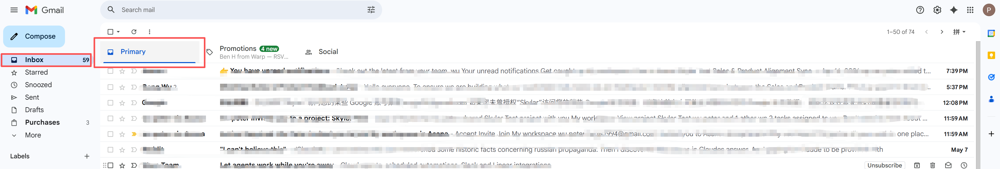

- `in:inbox is:unread`: scans all unread inbox messages without limiting to the Primary category. If your Gmail account does not show Primary, use this value.

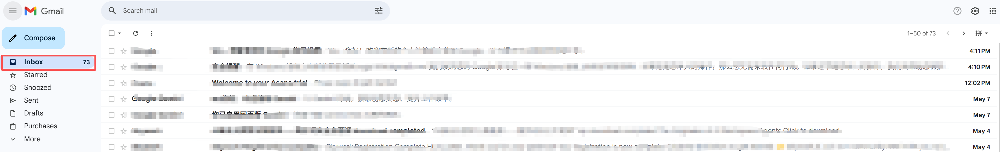

`Executive Memory Gmail query` is also selectable and follows the same logic:

- `in:inbox category:primary`: scans messages in the Primary inbox.
- `in:inbox`: scans all inbox messages.

## 5. Enable the Automations You Need

At the bottom of the **Setup** page there are three automation switches:

- `Enable Gmail to Asana automation`: when enabled, Skylar periodically reads matching unread Gmail messages and creates Asana tasks for important requirements or meetings.
- `Enable Mail Reply drafts`: when enabled, Skylar generates local reply drafts for unread Gmail messages. Replies are sent only after the user confirms.
- `Enable Gmail document drafts`: when enabled, Skylar combines Gmail requirements with Drive materials to generate document drafts.

These switches only control whether background workers run. After saving, it is recommended to restart Skylar so the background workers use the latest configuration.

## 6. Save Configuration and Restart

1. After filling in the configuration, click `Save setup`.
2. `Save setup` only saves the configuration. It does not immediately fetch Gmail, Drive, Asana, or RSS data.
3. After changing an API key, project name, Drive folder, query, or automation switch, exit and reopen Skylar.
4. After reopening, Skylar starts background services and workers using the saved configuration.
5. When upgrading Skylar, you usually do not need to configure it again. User configuration, the Google token, SQLite databases, and logs are kept in the local user data directory.

## 7. Data and Security

The Skylar desktop app stores user data in the local user directory. It does not write user data to the installation directory, and user data is not bundled into the installer.

- Windows: `%LOCALAPPDATA%\Skylar`
- macOS: `~/Library/Application Support/Skylar`

This directory typically stores local setup configuration, the Google OAuth token, SQLite databases, runtime logs, and automation state.

The installer does not include your Gmail token, Asana PAT, DashScope API key, or local data. Upgrading the application only replaces program code and does not delete user data.

## 8. Troubleshooting

### Google OAuth Fails

Select and save `credentials.json` again, then click `Start Google OAuth`. If it still fails, confirm that the Google OAuth client and authorization account are valid, and that the scopes include Gmail read/modify/send and Drive readonly/file.

### Tasks Has No Data

Check the following:

- Gmail has unread messages matching `Gmail to Asana query`.
- `Enable Gmail to Asana automation` is enabled.
- `Asana personal access token` is valid.
- `Gmail to Asana project name` is an Asana project accessible by the current PAT.
- Skylar has been restarted after saving configuration.

### Mail Reply Has No Drafts

Check the following:

- Gmail has unread messages matching `Mail Reply query`.
- The sender can be replied to. `no-reply`, notification, and bounce emails are skipped.
- `Enable Mail Reply drafts` is enabled.
- Skylar has been restarted after saving configuration.

### Doc Drafts Has No Document Drafts

Check the following:

- Gmail has unread requirement emails matching `Document Generate query`.
- The Google Drive folder name is correct.
- The Google token includes Drive permissions.
- `LLM API Key` is valid and `LLM Model` is selected.
- `Enable Gmail document drafts` is enabled.
- Skylar has been restarted after saving configuration.

### Executive Memory Has Too Few Contacts

Check the following:

- `Executive Memory Gmail query` is not limited too narrowly to Primary.
- `Executive Memory Gmail max results` is not too small.
- Gmail senders are recognizable, replyable contacts. System notifications and no-reply messages are filtered.

### Do I Need to Configure Again After an Upgrade?

No, normally you do not. Skylar stores user data in the local user data directory. Upgrading only replaces application code and does not delete Setup configuration, the Google token, SQLite databases, or logs.

## 9. Google Gmail and Drive API Setup Steps

### Step 1: Create a Project

1. Sign in to Google Cloud Console.
2. At the top of the page, click the project selector, usually labeled `Select a project`, then click `New Project`.

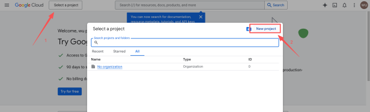

3. Enter a project name, for example `Skylar-Tool`, and click `Create`.

### Step 2: Enable API Services

You need to tell Google which services this project will use:

1. In the left menu, choose `APIs & Services` > `Library`.

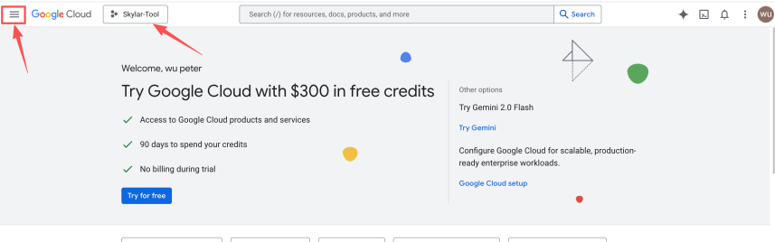

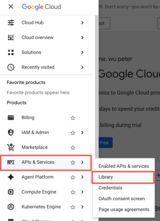

2. Search for and enable these two APIs:

- `Google Drive API`
- `Gmail API`

3. Open each API and click `Enable`.

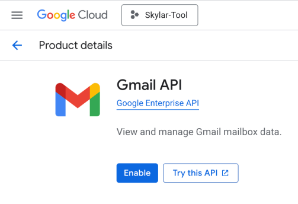

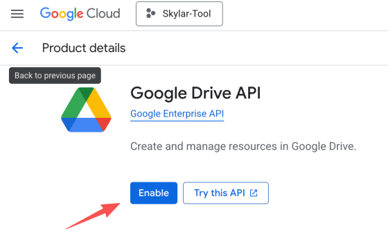

### Step 3: Configure the OAuth Consent Screen

The OAuth consent screen defines who can authorize this application.

1. Return to `APIs & Services` > `OAuth consent screen`.

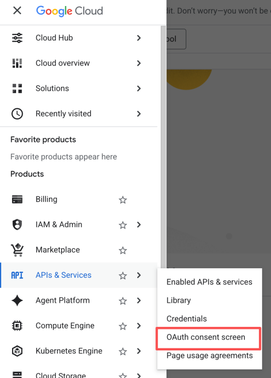

2. Choose the user type:

- If you use a company domain email account through Google Workspace, choose `Internal`.
- If you use a personal Gmail account such as `@gmail.com`, choose `External`.

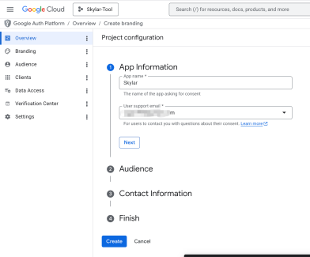

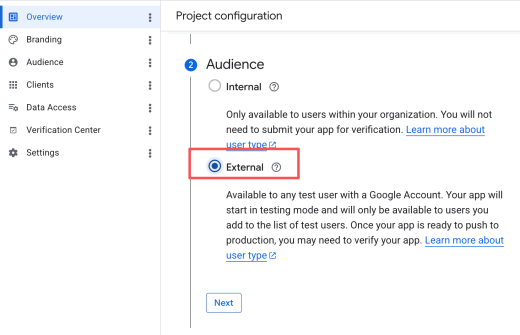

3. Fill in the required information, including app name, user support email, and developer contact information.
4. For scopes, click `Add or Remove Scopes`, search for and add `../auth/gmail.readonly`, `../auth/gmail.modify`, `../auth/gmail.send`, `../auth/drive.readonly`, and `/auth/drive.file`, or choose the permissions you need. You can also manually add these scopes:

```text
https://www.googleapis.com/auth/gmail.readonly,
https://www.googleapis.com/auth/gmail.modify,
https://www.googleapis.com/auth/gmail.send,
https://www.googleapis.com/auth/drive.readonly,
https://www.googleapis.com/auth/drive.file
```

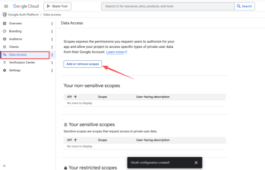

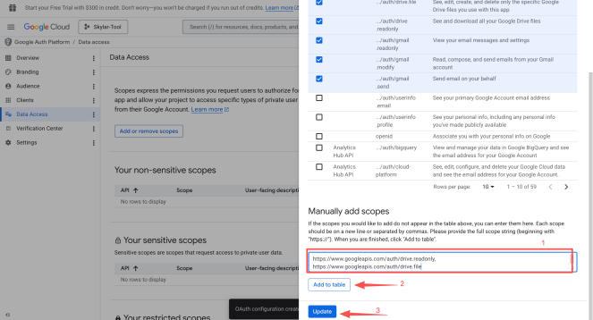

5. Save after the scopes are added.

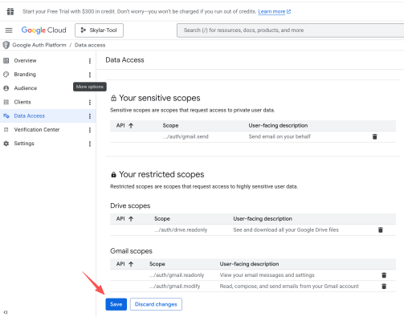

6. For `Test Users` when using `External`, make sure to add the Gmail address you use. Otherwise, authorization may fail later.

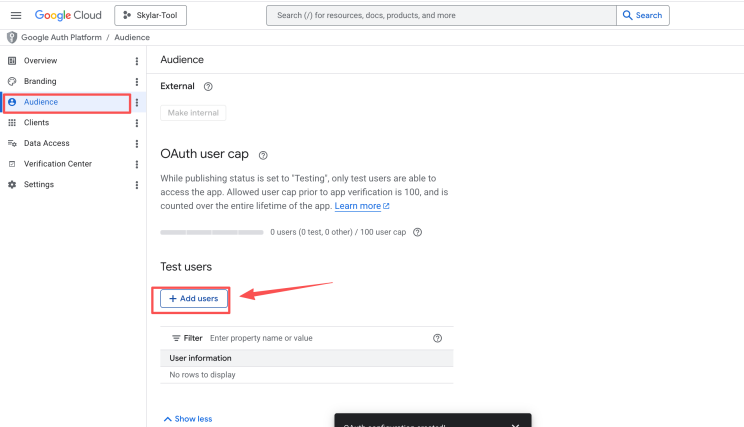

### Step 4: Create Credentials and Download JSON

This is the final and most important step.

1. Click `Clients` in the left menu.
2. Click `+ Create client`, then select `OAuth client ID`.

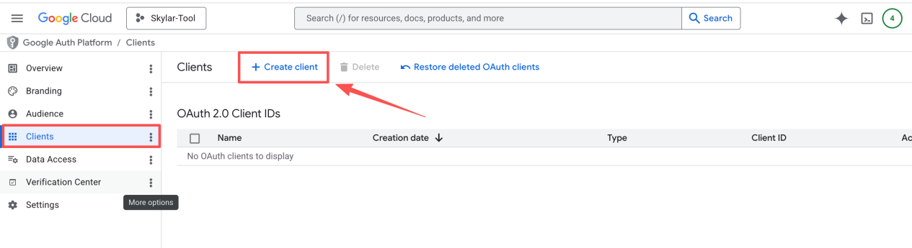

3. Choose the application type:

- If you run locally, such as with Python or Node.js scripts, choose `Desktop app`.
- If you run on a server, choose `Web application`.

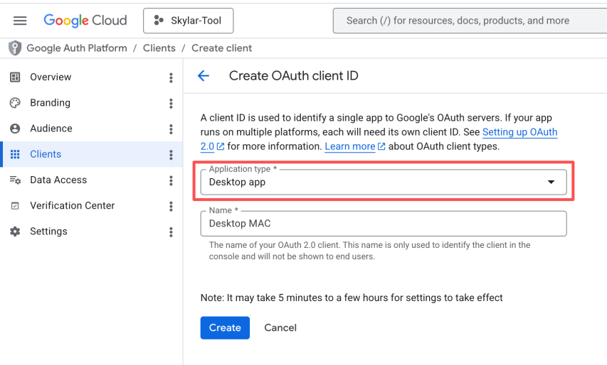

4. Click `Create`.
5. The dialog shows `OAuth client created`. Click `Download JSON`.

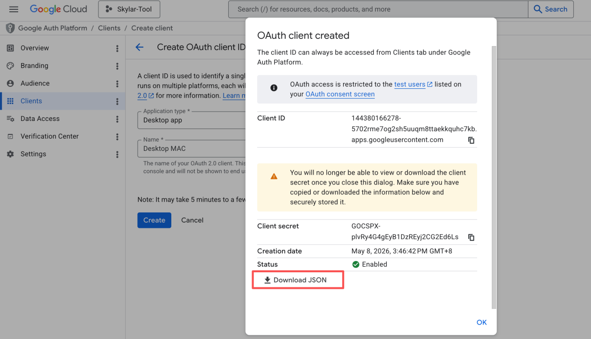

6. Rename the downloaded file. The downloaded file name is usually long. Rename it to `credentials.json`. It is recommended to place it in your project root directory.

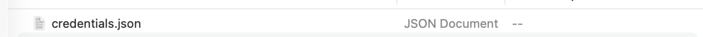

## 10. Asana API Setup Steps

### Sign in to Asana

Sign in to your Asana account and make sure this account can access the projects, tasks, teams, or workspace you want Skylar to read or update. A PAT has the same permissions as the Asana user who creates it. In other words, data that this user cannot see in Asana cannot be accessed through the API either.

### Open the Asana Developer Console

Open Asana personal settings, go to **Apps**, and then open the developer application management page.

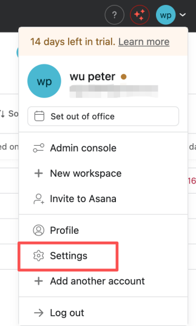

Select **Apps**, scroll to the bottom, and open the developer console.

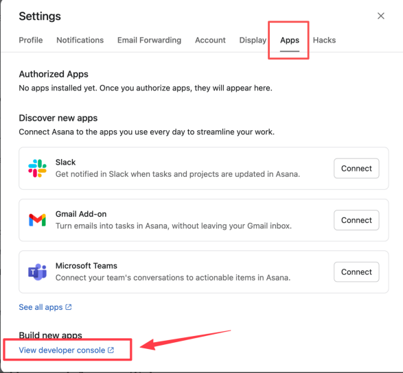

### Create a Personal Access Token

In the **Personal access tokens** area, click `Create new token` or `New access token`.

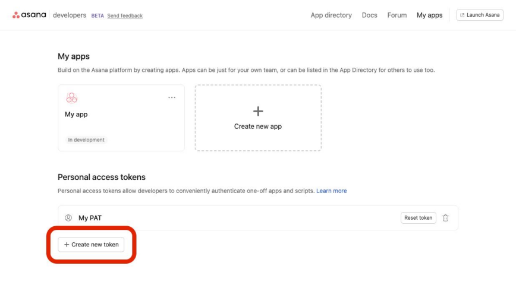

Then fill in the following fields:

| Field | Example |
| --- | --- |
| Token name | `internal-report-script`, `n8n-integration`, `asana-backup` |
| API terms | Check the box to accept the Asana API terms |

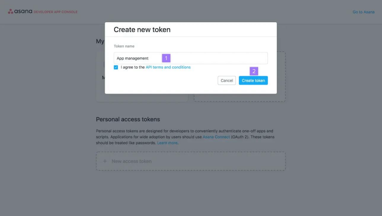

After you click `Create token`, Asana generates a token. Asana's quick-start documentation notes that the token is shown only once, so copy it immediately and store it securely.

### Store the Token Securely

Save the token in a secure place, for example:

```env
ASANA_ACCESS_TOKEN=your_token
```

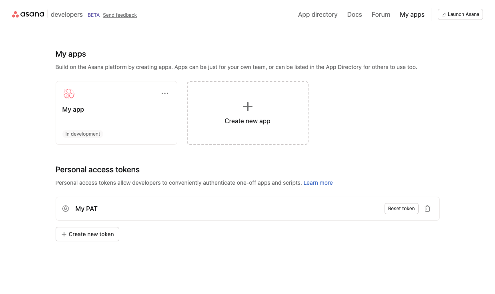
